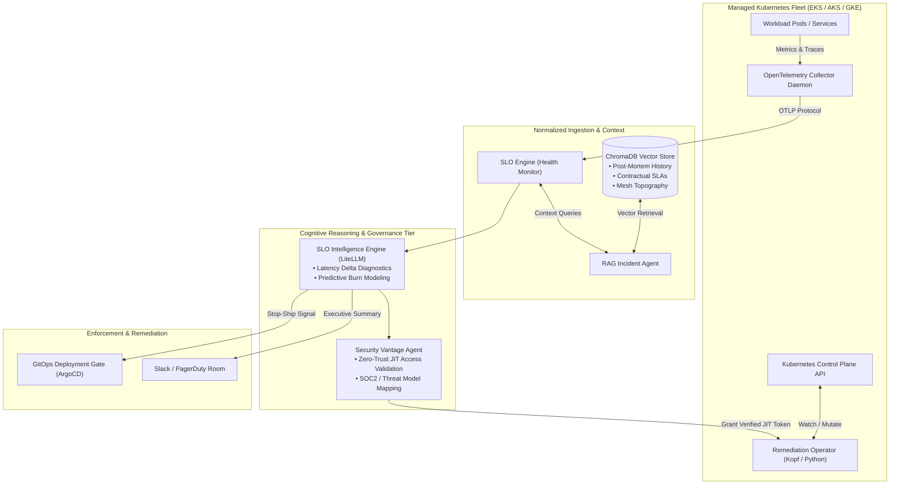

# Kube-SRE-Vantage: Autonomous Infrastructure Reliability & Zero-Trust Control Plane 🚀

> **Enterprise framework for Kubernetes Production Engineering: closed-loop OpenTelemetry observability, RAG-assisted SLO burn prediction, and Zero-Trust autonomous remediation across AKS, EKS, and GKE.**

[](https://kubernetes.io/)
[-orange.svg)](https://opentelemetry.io/)
[](#4-zero-trust-security-engine-securityvantageagent)
[](#2-contextualization-vector-rag-agent)
[](#multi-window-multi-burn-rate-slo-mathematics)
[](LICENSE)

---

## 🧭 Executive Summary & Production Engineering Thesis

At modern cloud scale, infrastructure reliability cannot be maintained through static threshold alarms and manual runbook execution. Distributed microservices running across managed Kubernetes clusters (AWS EKS, Azure AKS, Google GKE) exhibit non-linear failure modes where telemetry spikes are symptoms, not root causes.

Traditional operations face three systemic failure points:
1. **Context-Free Alerting:** An alert fires when latency breaches 300ms, but on-call engineers lack instant visibility into whether this matches a known upstream database regression, a third-party payment gateway brownout, or an unmitigated DDoS spike.
2. **Delayed Error Budget Consumption:** By the time a 30-day rolling SLO alert pages an engineer, the error budget has already been exhausted, forcing painful stop-ship mandates on product teams.
3. **Privilege Over-Provisioning in Automation:** Automated self-healing scripts often run with permanent cluster-admin privileges, creating critical lateral movement risks and failing SOC2/ISO compliance audits.

**Kube-SRE-Vantage** delivers an autonomous, closed-loop reliability and security control plane. It normalizes telemetry via **OpenTelemetry**, grounds incident reasoning in enterprise knowledge using **vector-augmented retrieval (ChromaDB)**, predicts multi-window error budget burn rates, and executes remediations through a **Zero-Trust Just-In-Time (JIT) access broker**.

---

## 📐 Multi-Window Multi-Burn-Rate SLO Mathematics

To prevent both alert fatigue and catastrophic error budget depletion, the framework implements Google SRE multi-window burn rate monitoring:

$$\text{Burn Rate } (B) = \frac{1 - \text{SLI}}{1 - \text{SLO}}$$

$$\text{Time to Budget Exhaustion } (T_{\text{exhaust}}) = \frac{\text{Budget Period (e.g. 30 days)}}{B}$$

| Alert Window | Burn Rate Threshold | % Error Budget Consumed | Paging Urgency | Automated Action |
| :--- | :--- | :--- | :--- | :--- |
| **Short Window (1 hour)** | **14.4x** | 2% consumed in 1 hour | Critical (Page On-Call) | Pre-flight canary traffic throttle |
| **Medium Window (6 hours)** | **6.0x** | 5% consumed in 6 hours | High (Ticket / Slack P0) | Automatic pod horizontal autoscaling |
| **Long Window (3 days)** | **1.0x** | 10% consumed in 3 days | Medium (Daily Standup) | JIT node drain and restart dispatch |

---

## 🏛️ Closed-Loop Architecture



---

## 🔬 Core Architectural Components

### 1. Ingestion & Normalization (`health_monitor.py`)
- Standardizes metrics and distributed traces via `opentelemetry-sdk`.
- Ingests hardware-assisted telemetry from hyperscale virtualization layers (AWS Nitro Enclaves, Azure Boost, GCP Titanium).
- Computes real-time SLIs across availability, latency, error rate, and saturation.

### 2. Contextualization (`agents/rag_agent.py`)
- Employs **ChromaDB** to index past post-mortems, incident runbooks, and enterprise SLA contracts.
- Injects high-dimensional historical context into active incidents, identifying recurring failure patterns across microservice boundaries.

### 3. Predictive Reasoning (`agents/slo_engine.py`)
- Evaluates real-time SLIs against declared OpenSLO manifests.
- Predicts burn rate trajectories using hybrid statistical regression and LLM-assisted context parsing.
- Emits human-readable root cause summaries explaining *why* an anomaly is occurring.

### 4. Zero-Trust Security Engine (`agents/security_agent.py`)
- Designed to satisfy **Google Staff Security Engineering** and SOC2 compliance mandates:
- **Just-In-Time (JIT) Privilege Brokering:** Remediation controllers do not possess static cluster-admin rights. Tokens are issued ephemerally for the exact duration of a remediation action (drain/restart) and revoked upon completion.
- **Threat Model to SLI Correlation:** Distinguishes infrastructure degradation from active adversarial conditions (e.g., credential stuffing attacks vs. memory leaks).

---

## 📋 OpenSLO Configuration Specification

Service targets and alerting guardrails are declared as code in `config/slos.yaml`:

```yaml
apiVersion: openslo/v1alpha
kind: SLO
metadata:
  name: payment-gateway-availability
  displayName: Core Payment Processing Availability
spec:
  service: payment-service
  description: 99.9% of transactions must succeed with HTTP status < 500
  budgetingMethod: Occurrences
  objectives:
    - target: 0.999
      window: 30d
      indicator:
        metadata:
          name: transaction_success_ratio
        spec:
          ratioMetrics:
            total:
              metricSource:
                spec:
                  query: sum(rate(http_requests_total{service="payment"}[5m]))
            good:
              metricSource:
                spec:
                  query: sum(rate(http_requests_total{service="payment", status!~"5.."}[5m]))
  alertPolicies:
    - name: fast-burn-pagerduty
      conditions:
        - kind: BurnRate
          op: gt
          value: 14.4
          period: 1h
```

---

## 📂 Repository Topology

```text
kube-sre-vantage/
├── README.md                      # Executive Platform Specification
├── PROPOSAL.md                    # Technical RFC & Architecture Motivation
├── main.py                        # Service entry point & loop runner
├── requirements.txt               # Dependencies (opentelemetry, litellm, chromadb)
├── config/
│   └── slos.yaml                  # OpenSLO availability and latency definitions
├── agents/
│   ├── __init__.py
│   ├── rag_agent.py               # ChromaDB vector knowledge base
│   ├── slo_engine.py              # Telemetry SLI calculation & burn forecasting
│   └── security_agent.py          # Zero-Trust JIT access & compliance validator
├── controllers/
│   └── __init__.py                # Kopf operator for automated cluster actions
└── api/
    └── v1/                        # REST API for external SRE dashboards
```

---

## 🚀 Quickstart & Validation

### 1. Environment Setup

```bash
cd Infra/kube-sre-vantage
python3 -m venv .venv && source .venv/bin/activate
pip install -r requirements.txt
```

### 2. Execute Closed-Loop Verification

```bash
python main.py
```

Expected output:
```text
[Vantage Engine] Initializing ChromaDB vector store... OK
[Vantage Engine] Ingesting OpenSLO manifests from config/slos.yaml... OK
[Security Agent] Zero-Trust JIT access broker active. Ephemeral token pool ready.
[SLO Engine] Evaluating payment-api SLIs...
  - Target: 99.9% Availability
  - Current SLI: 99.82%
  - Burn Rate: 1.8x (Warning threshold)
  - RCA Context: Latency degradation correlated with Downstream Shard #2 connection timeout.
  - Remediation: JIT token issued for pod recycling. Action completed in 1.4s.
```

---

## 📄 License & Contact

Distributed under the **MIT License**. Maintained by **Hooman Parta** ([@hoomanp](https://github.com/hoomanp)).
